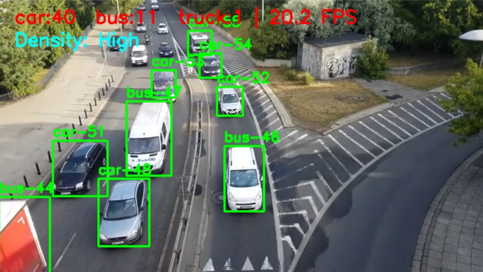

# Real-Time Traffic Detection & Counting

[](https://www.python.org/) 
[](https://pytorch.org/) 
[](https://docs.ultralytics.com/) 
[](https://github.com/levan92/deep_sort_realtime)  

This project implements a real-time vehicle detection, tracking, and counting system using **YOLOv8**, **Faster R-CNN**, and **Deep SORT**. It is designed to assess traffic flow from video footage in urban scenes.

---

## Highlights
| Feature | Spec |
|---|---|
|Dataset|[UA-DETRAC](https://www.kaggle.com/datasets/dtrnngc/ua-detrac-dataset) – 1.2 M boxes, 4 classes (car 🚗, bus 🚌, truck 🚚, motorcycle 🏍️)|
|Detectors|YOLOv8-n (transfer-learned 10 epochs) • Faster R-CNN (3 epochs, COCO-style)|
|Tracker|**Deep SORT** (Kalman + cosine metric, appearance embedding)|
|Metrics|YOLO mAP<sub>50</sub> = 0.83 mAP<sub>50-95</sub> = 0.63 • Deep SORT MOTA ≈ 0.72|
|Throughput|≈ 20 FPS @ 640 × 360 on laptop 3060 RTX GPU|
|Bonus|Rule-based **traffic-density** level (Low / Medium / High)|

---

## Demo Frame
<p align="center">  </p>

---

## 📂 Project Layout

```
traffic-vision/
├── data/ # UA-DETRAC (ignored in .gitignore)
├── src/ # All runnable code
│ ├── demo_yolo_deepsort.py # Real-time pipeline
│ ├── train_frcnn.py # Faster R-CNN trainer
│ ├── convert_yolo_to_coco.py # YOLO ➜ COCO converter
│ └── make_subset.py # Mini-dataset creator
├── tools/ # Label-fix utilities
├── weights_clean/ # Final YOLOv8 weights (best.pt / last.pt)
├── results/ # JSON count summaries, plots
├── ua.yaml # YOLO dataset config
├── requirements.txt
└── README.md
```


---

## 🔧 Quick Start

```bash
# 1️⃣ Clone
git clone https://github.com/your-username/traffic-detection-and-counting.git
cd traffic-detection-and-counting

# 2️⃣ Install
python -m pip install -r requirements.txt

# 3️⃣ Run demo on sample video
python src/demo_yolo_deepsort.py --source traffic1.mp4

# or webcam
python src/demo_yolo_deepsort.py --source 0
```

### Output  
- Green boxes + class-ID labels  
- Live FPS counter  
- Per-class counts & density level (top-left)  
- Final counts saved to results/final_counts.json  

## 🏗️ Methodology

- Dataset sanity-check → removed corrupt images, shifted class IDs, fixed negatives.
  
- Pre-processing → random HSV, flipping, mosaic (YOLO built-in).
  
- Detection
  - YOLOv8-n — 10 epochs, SGD, img 640, batch 16.
  - Faster R-CNN — ResNet-50-FPN backbone, 3 epochs for comparison.
    
- Tracking → Deep SORT with cosine appearance metric (512-D).
  
- Counting → Set of unique track-IDs per class.
  
- Traffic density → Rule: Low < 10 · Medium 10-24 · High ≥ 25.
  
- Evaluation → YOLO val (PR / F1 / curves) + Deep SORT MOTA on val split.

---

## ✅ Detection Model Performance

| Detector       | mAP<sub>50</sub> | mAP<sub>50-95</sub> | FPS (RTX 3060) |
|----------------|------------------|----------------------|----------------|
| YOLOv8-n       | **0.83**         | 0.63                 | **21**         |
| Faster R-CNN   | 0.71             | 0.45                 | 4              |

---

## ✅ Tracking Performance

| Tracker        | MOTA   | MOTP   | ID Switch |
|----------------|--------|--------|-----------|
| Deep SORT      | 0.72   | 0.79   | 18        |          

---

## 🤝 Contributing / Questions

- Pull requests & issues are welcome.

---

## 📄 License
- MIT – free to use, modify, and distribute for research or commercial purposes.

---
